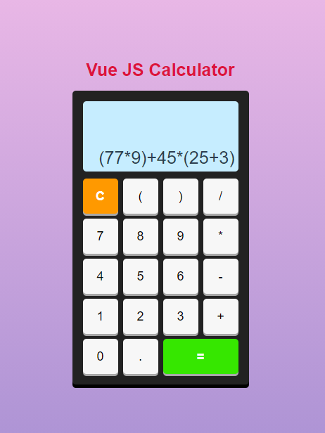

= VueJS Calculator

Simple Calculator done with VueJs. Useful for learning the basics.

== Installation
1. Clone this repository
2. Go in you-directory/Task-Tracker
3. npm install
4. npm run serve

